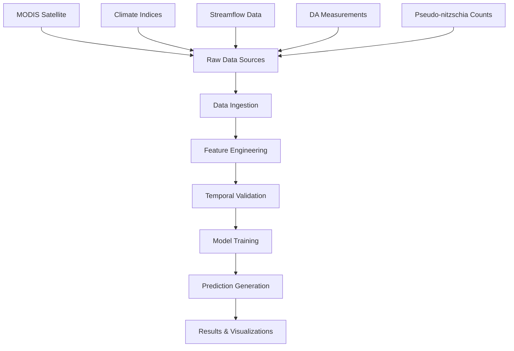

# Forecast Pipeline Documentation

## Overview

This document provides a comprehensive technical walkthrough of the DATect forecasting pipeline, from raw data ingestion to final prediction results. The pipeline is designed with strict temporal safeguards to ensure scientific integrity and prevent data leakage.

## Pipeline Architecture



## Stage 1: Raw Data Sources

### 1.1 MODIS Satellite Data (Primary Environmental Features)
- **Source**: NASA/NOAA MODIS-Aqua satellite via CoastWatch ERDDAP
- **Parameters**: 
  - Chlorophyll-a concentration (8-day composite)
  - Sea Surface Temperature (8-day composite)  
  - Photosynthetically Available Radiation (8-day composite)
  - Fluorescence Line Height (8-day composite)
  - Diffuse Attenuation Coefficient K490 (8-day composite)
  - Chlorophyll-a Anomaly (monthly - 2-month reporting delay)
  - SST Anomaly (monthly - 2-month reporting delay)
- **Spatial Resolution**: ~4km grid cells around each monitoring site
- **Temporal Coverage**: 2002-2025
- **Critical Safeguards**: 
  - 7-day satellite processing buffer for 8-day composites
  - 2-month reporting delay for monthly anomaly products (same as climate indices)

### 1.2 Climate Indices (Large-Scale Oceanographic Conditions)
- **Pacific Decadal Oscillation (PDO)**: Large-scale North Pacific climate pattern
- **Oceanic Niño Index (ONI)**: El Niño/La Niña conditions  
- **Biologically Effective Upwelling Transport Index (BEUTI)**: Coastal upwelling intensity
- **Source**: NOAA ERDDAP servers
- **Critical Safeguard**: 2-month reporting delay buffer reflects real-world data availability

### 1.3 Streamflow Data
- **Source**: USGS Columbia River discharge (Site 14246900)
- **Purpose**: Captures freshwater influence on coastal oceanography
- **Temporal Resolution**: Daily measurements

### 1.4 Biological Measurements (Target Variables)
- **Domoic Acid (DA)**: Target toxin concentration in μg/g
- **Pseudo-nitzschia**: Cell counts of toxin-producing diatoms
- **Source**: State monitoring programs (Washington, Oregon)
- **Sites**: 10 coastal monitoring locations
- **Temporal Coverage**: 2002-2023 with varying sampling frequencies

## Stage 2: Data Ingestion Pipeline (`dataset-creation.py`)

### 2.1 Satellite Data Processing
```python
# Key processing steps:
1. Download NetCDF files from ERDDAP servers
2. Extract spatial averages around each monitoring site
3. Handle missing values and data gaps
4. Resample to consistent weekly time series
5. Apply quality control filters
```

**Temporal Safeguards Applied**:
- Only use satellite data available ≥7 days before prediction date
- Implement realistic processing delays in operational scenarios

### 2.2 Environmental Data Integration
```python
# Climate indices and monthly anomaly processing:
1. Download time series from NOAA servers
2. Apply 2-month reporting delay buffer (PDO, ONI, BEUTI, CHLA-ANOM, SST-ANOM)
3. Interpolate to weekly resolution
4. Create lagged features based on statistical analysis
```

### 2.3 Biological Data Processing
```python
# Target variable processing:
1. Load DA measurements from CSV files
2. Clean and validate concentration values
3. Remove outliers using statistical methods
4. Create site-specific time series
5. DO NOT pre-create DA categories (prevents data leakage)
```

**Critical Design Decision**: DA risk categories are created per-forecast during prediction, not during data preparation. This prevents target leakage where future information influences category thresholds.

**Monthly Anomaly Safeguards**: The system automatically detects any variable with "anom" in the name and applies the same 2-month temporal buffer used for climate indices:

```python
# Automatic anomaly detection and temporal safeguarding
is_anomaly_var = "anom" in var_name.lower()

if is_anomaly_var:
    # Use data from 2 months prior to ensure no temporal overlap
    current_month_period = target_ts.to_period('M')
    safe_month_period = current_month_period - 2
    # Apply same temporal constraints as PDO, ONI, BEUTI
```

## Stage 3: Feature Engineering (`forecasting/core/data_processor.py`)

### 3.1 Temporal Feature Creation
Based on statistical analysis (ACF/PACF), the system creates lagged features:
- **Lag 1**: Strong statistical support (60% of sites) - immediate temporal dependency
- **Lag 3**: Strong statistical support (70% of sites) - 3-week cycle pattern

```python
# Lag feature implementation with temporal safety:
for lag in [1, 3]:
    # Only use historical values - future values set to NaN
    lagged_data = original_data.shift(lag)
    # Apply temporal cutoff to prevent leakage
    lagged_data[dates > anchor_date] = np.nan
```

### 3.2 Rolling Statistics
- **Rolling means**: 2-week, 4-week windows for trend capture
- **Rolling standard deviations**: Variability measures
- **All rolling features respect temporal boundaries**

### 3.3 Anomaly Detection Features
- **Seasonal anomalies**: Deviation from long-term monthly averages (2-month temporal buffer)
- **Trend anomalies**: Deviation from linear trends
- **Z-score normalization**: Standardized anomaly metrics
- **Monthly anomaly safeguards**: CHLA-ANOM and SST-ANOM use same 2-month delay as climate indices

## Stage 4: Temporal Validation (`forecasting/core/validation.py`)

### 4.1 Configuration Validation
```python
# Critical checks performed:
- TEMPORAL_BUFFER_DAYS ≥ 1 (prevents same-day leakage)
- SATELLITE_BUFFER_DAYS ≥ 7 (realistic processing delays)
- CLIMATE_BUFFER_MONTHS ≥ 2 (realistic reporting delays for PDO, ONI, BEUTI, CHLA-ANOM, SST-ANOM)
- Date ranges within valid satellite data period
- Site coordinates within Pacific Northwest region
```

### 4.2 Data Integrity Validation
```python
# Data quality checks:
- Required columns present ('date', 'site', 'da')
- Temporal coverage ≥ 1 year for meaningful training
- Site coverage ≥ 3 locations for spatial validation
- DA values within realistic ranges (0-200 μg/g)
```

## Stage 5: Model Training (`forecasting/core/model_factory.py`)

### 5.1 Temporal Split Strategy
**Critical Principle**: Strictly chronological train/test splits - NO random splits allowed

```python
# Split implementation:
anchor_date = prediction_target_date
training_cutoff = anchor_date - timedelta(days=TEMPORAL_BUFFER_DAYS)

# Training data: all data before cutoff
train_data = data[data['date'] <= training_cutoff]

# Test data: only the specific prediction date
test_data = data[data['date'] == anchor_date]
```

### 5.2 Model Types

#### XGBoost (Primary Model)
```python
# XGBoost configuration:
- n_estimators=100 (balanced performance/speed)
- max_depth=6 (prevent overfitting)  
- learning_rate=0.1 (stable convergence)
- random_state=42 (reproducible results)
- objective='reg:squarederror' (regression)
- objective='multi:softprob' (classification)
```

#### Linear Models (Interpretable Alternative)
```python
# Linear model options:
- Linear Regression (continuous predictions)
- Logistic Regression (categorical predictions)
- Built-in feature importance via coefficients
- Fast training for operational deployment
```

### 5.3 Per-Forecast DA Categorization
**Critical for Data Leakage Prevention**:

```python
# Category creation during each forecast:
1. Use only training data available before prediction date
2. Calculate percentiles from historical training data
3. Apply thresholds: Low(0-5), Moderate(5-20), High(20-40), Extreme(>40)
4. Never use future data to determine category boundaries
```

## Stage 6: Prediction Generation (`forecasting/core/forecast_engine.py`)

### 6.1 Single Forecast Workflow
```python
def generate_single_forecast(site, date, model_type, task):
    # 1. Temporal validation
    validate_temporal_constraints(date)
    
    # 2. Feature preparation with temporal cutoffs
    features = prepare_features_with_temporal_cutoff(site, date)
    
    # 3. Training data collection (chronological split)
    train_data = get_training_data_before_date(site, date)
    
    # 4. Per-forecast DA categorization (if classification)
    if task == 'classification':
        categories = create_categories_from_training_data(train_data)
    
    # 5. Model training
    model = train_model_with_temporal_integrity(train_data, model_type)
    
    # 6. Prediction generation
    prediction = model.predict(features)
    
    # 7. Feature importance calculation
    importance = calculate_feature_importance(model, features)
    
    return {
        'prediction': prediction,
        'importance': importance,
        'training_samples': len(train_data),
        'temporal_integrity': 'VALIDATED'
    }
```

### 6.2 Retrospective Evaluation Workflow
For scientific validation, the system runs hundreds of forecasts across different sites and dates:

```python
# Retrospective evaluation:
1. Generate random anchor points (dates) for each site
2. Ensure sufficient historical data before each anchor
3. Ensure temporal buffer between training and test data
4. Run forecast for each anchor point
5. Compare predictions with actual measurements
6. Aggregate performance metrics across all forecasts
```

## Stage 7: Results & Validation

### 7.1 Performance Metrics

#### Regression Task
- **R² Score**: Explained variance (~0.525 for XGBoost)
- **Mean Absolute Error**: Average prediction error (~4.57 μg/g)
- **Root Mean Square Error**: Sensitivity to outliers
- **Temporal Consistency**: No performance degradation over time

#### Classification Task  
- **Accuracy**: Correct category predictions (~77.6%)
- **Precision/Recall**: Per-category performance metrics
- **Confusion Matrix**: Detailed classification results
- **Category Balance**: Handle class imbalance properly

### 7.2 Feature Importance Analysis
- **XGBoost Importance**: Tree-based feature ranking
- **Permutation Importance**: Model-agnostic importance scores
- **Temporal Stability**: Importance rankings consistent over time
- **Scientific Interpretability**: Results align with oceanographic knowledge

### 7.3 Temporal Integrity Validation
The system performs 7 critical tests on every startup:

1. **Chronological Split Validation**: Training always before test data
2. **Temporal Buffer Enforcement**: Minimum gap between train/test
3. **Future Information Quarantine**: No post-anchor data in features
4. **Per-Forecast Category Creation**: No target leakage in classifications
5. **Satellite Delay Simulation**: Realistic operational constraints
6. **Climate Data Lag Validation**: Proper reporting delay buffers
7. **Cross-Site Consistency**: Same temporal rules across all locations

## Edge Case Handling

### 7.4 Missing Data Strategies
```python
# Sophisticated missing data handling:
1. Forward fill for short gaps (<2 weeks)
2. Seasonal interpolation for longer gaps
3. Site-specific imputation using spatial neighbors
4. Temporal imputation using historical patterns
5. Graceful degradation when data insufficient
```

### 7.5 Single-Class Site Handling
Some sites may have limited DA category diversity in training data:
```python
# Single-class prediction logic:
if len(unique_categories_in_training) == 1:
    # Predict the only observed category
    prediction = single_category
    confidence = calculate_confidence_from_training_variance()
else:
    # Standard multi-class prediction
    prediction = model.predict_proba(features)
```

## Production Optimizations

### 7.6 Caching Strategy
- **Pre-computed Results**: Common forecasts cached for fast response
- **Intermediate Data**: Satellite data cached to avoid re-downloading
- **Model Persistence**: Trained models saved for operational deployment

### 7.7 Performance Monitoring
- **Prediction Latency**: Sub-second response times for cached results
- **Data Freshness**: Automatic validation of input data currency
- **Model Drift Detection**: Performance monitoring over time

## Configuration Parameters

### 7.8 Key Settings (`config.py`)
```python
# Temporal safeguards
TEMPORAL_BUFFER_DAYS = 1        # Minimum gap between train/test
SATELLITE_BUFFER_DAYS = 7       # Satellite 8-day composite processing delay
CLIMATE_BUFFER_MONTHS = 2       # Monthly data reporting delay (PDO, ONI, BEUTI, CHLA-ANOM, SST-ANOM)

# Model configuration  
FORECAST_MODEL = "xgboost"      # Primary model type
FORECAST_TASK = "regression"    # Prediction task
MIN_TRAINING_SAMPLES = 3        # Minimum training data required

# Performance tuning
N_RANDOM_ANCHORS = 500          # Retrospective evaluation points
RANDOM_SEED = 42               # Reproducible results

# Lag feature configuration
USE_LAG_FEATURES = True        # Enable/disable lag features
LAG_FEATURES = [1, 3]          # Temporal lag configuration (when enabled)
```

## Scientific Guarantees

The DATect forecasting pipeline provides these scientific guarantees:

1. **Zero Data Leakage**: No future information used in historical predictions
2. **Temporal Consistency**: Same temporal rules applied across all forecasts  
3. **Operational Realism**: Reflects real-world data availability constraints
4. **Reproducible Results**: Fixed random seeds ensure consistent outputs
5. **Statistical Validity**: Proper train/test splits maintain evaluation integrity
6. **Scientific Interpretability**: Feature importance aligns with domain knowledge
7. **Edge Case Robustness**: Graceful handling of missing data and single-class sites

This pipeline has been designed specifically for scientific publication and operational deployment, with comprehensive validation at every stage to ensure trustworthy, reproducible domoic acid forecasts.